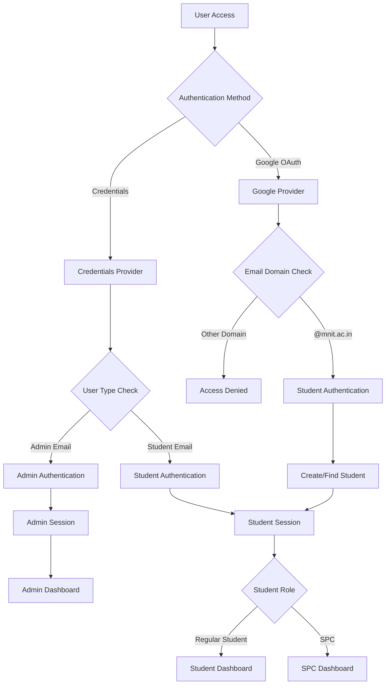
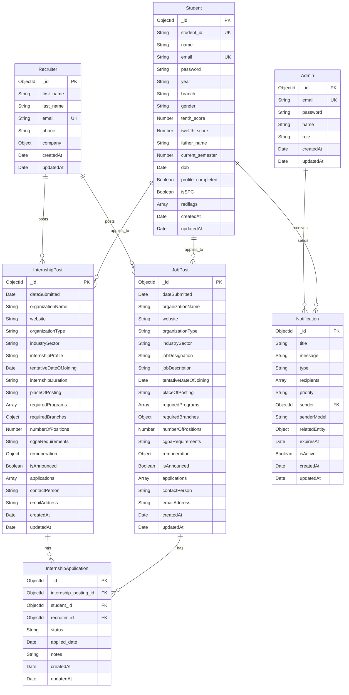

# 🎓 Placement Portal - MNIT Jaipur

A comprehensive placement management system for Malaviya National Institute of Technology Jaipur, built with Next.js, MongoDB, and modern web technologies.

## 📋 Table of Contents

- [Overview](#overview)
- [Features](#features)
- [Technology Stack](#technology-stack)
- [System Architecture](#system-architecture)
- [Database Schema](#database-schema)
- [User Roles & Permissions](#user-roles--permissions)
- [Installation & Setup](#installation--setup)
- [Environment Variables](#environment-variables)
- [API Documentation](#api-documentation)
- [Development](#development)
- [Deployment](#deployment)
- [Contributing](#contributing)

## 🎯 Overview

The Placement Portal is a full-stack web application designed to streamline the placement process at MNIT Jaipur. It provides separate interfaces for students, recruiters, Student Placement Coordinators (SPC), and administrators, enabling efficient job posting, application management, and placement coordination.

## ✨ Features

### 🎓 Students
- **Authentication**: Google OAuth (college email only) or credentials
- **Profile Management**: Complete academic and personal information
- **Job/Internship Browsing**: View and search available opportunities
- **Application System**: Submit applications with status tracking
- **Notifications**: Real-time updates on application status
- **Dashboard**: Personalized view of applications and announcements

### 👨‍💼 Recruiters
- **Job Posting**: Create detailed job and internship postings
- **Application Review**: Review and manage student applications
- **Candidate Selection**: Shortlist and select candidates
- **Communication**: Direct communication with placement cell

### 🎯 Student Placement Coordinators (SPC)
- **Enhanced Student Features**: All student capabilities plus:
- **Red Flag Management**: Flag students for administrative review
- **Student Oversight**: Monitor student profiles and applications
- **Application Monitoring**: Track application statistics

### 👨‍💻 Administrators
- **System Management**: Full control over the platform
- **User Management**: Manage students, SPCs, and recruiters
- **Content Approval**: Approve job and internship postings
- **Announcement System**: Broadcast important updates
- **Analytics**: Comprehensive reporting and statistics
- **Red Flag Review**: Review and manage student red flags

## 🛠️ Technology Stack

### Frontend
- **Framework**: Next.js 15.3.3 (React 19) with App Router
- **Styling**: Tailwind CSS + Radix UI Components
- **Icons**: Lucide React
- **Charts**: Recharts
- **Authentication**: NextAuth.js

### Backend
- **Runtime**: Node.js
- **API**: Next.js API Routes (Serverless Functions)
- **Database**: MongoDB with Mongoose ODM
- **Authentication**: NextAuth.js (Google OAuth + Credentials)
- **Password Hashing**: bcryptjs

### Development Tools
- **Linting**: ESLint
- **Package Manager**: npm
- **Version Control**: Git

## 🏗️ System Architecture

### Architecture Layers

```
┌─────────────────────────────────────────────────────────────┐
│                    PRESENTATION LAYER                       │
├─────────────────────────────────────────────────────────────┤
│  Next.js App Router (Pages & Components)                    │
│  ├── / (Home)                                               │
│  ├── /login (Authentication)                                │
│  ├── /dashboard (Student Dashboard)                         │
│  ├── /admin/* (Admin Interface)                             │
│  ├── /spc/* (SPC Interface)                                 │
│  ├── /recruiter/* (Recruiter Interface)                     │
│  └── /student/* (Student Interface)                         │
└─────────────────────────────────────────────────────────────┘
                              │
┌─────────────────────────────────────────────────────────────┐
│                     API LAYER                               │
├─────────────────────────────────────────────────────────────┤
│  Next.js API Routes                                         │
│  ├── /api/auth/* (Authentication)                           │
│  ├── /api/admin/* (Admin Operations)                        │
│  ├── /api/spc/* (SPC Operations)                            │
│  ├── /api/student/* (Student Operations)                    │
│  └── /api/recruiter/* (Recruiter Operations)                │
└─────────────────────────────────────────────────────────────┘
                              │
┌─────────────────────────────────────────────────────────────┐
│                   BUSINESS LOGIC LAYER                      │
├─────────────────────────────────────────────────────────────┤
│  Mongoose Models & Validation                               │
│  ├── Student Management                                     │
│  ├── Job/Internship Posting                                 │
│  ├── Application Processing                                 │
│  ├── Notification System                                    │
│  └── Role-based Access Control                              │
└─────────────────────────────────────────────────────────────┘
                              │
┌─────────────────────────────────────────────────────────────┐
│                    DATA LAYER                               │
├─────────────────────────────────────────────────────────────┤
│  MongoDB Database                                           │
│  └── Collections: Students, Jobs, Internships, etc.         │
└─────────────────────────────────────────────────────────────┘
```

### Authentication & Authorization Flow



## 🗄️ Database Schema

### Entity Relationship Diagram



### Key Collections

1. **Students**: Core user data with academic information
2. **Admins**: Administrative users with role-based access
3. **Recruiters**: Company representatives posting opportunities
4. **JobPosts**: Full-time job opportunities
5. **InternshipPosts**: Internship opportunities
6. **Applications**: Student applications with status tracking
7. **Notifications**: System-wide notification management

## 👥 User Roles & Permissions

### 🎓 Students
- **Authentication**: Google OAuth (@mnit.ac.in) or credentials
- **Profile**: View and edit personal information
- **Applications**: Submit and track job/internship applications
- **Dashboard**: View announcements and application status

### 🎯 Student Placement Coordinators (SPC)
- **All Student Permissions** plus:
- **Red Flag Management**: Flag students for review
- **Student Oversight**: Monitor student profiles
- **Application Analytics**: View application statistics

### 👨‍💼 Recruiters
- **Job Posting**: Create and manage job/internship posts
- **Application Review**: Review submitted applications
- **Candidate Management**: Shortlist and select candidates
- **Communication**: Direct contact with placement cell

### 👨‍💻 Administrators
- **Full System Access**: Complete platform control
- **User Management**: Manage all user accounts
- **Content Moderation**: Approve job/internship posts
- **System Configuration**: Manage announcements and settings
- **Analytics**: Comprehensive reporting and statistics

## 🚀 Installation & Setup

### Prerequisites
- Node.js 18+ 
- MongoDB database
- Google OAuth credentials (for student login)

### 1. Clone the Repository
```bash
git clone <repository-url>
cd placement-portal-nextjs-js
```

### 2. Install Dependencies
```bash
npm install
```

### 3. Environment Setup
Create a `.env.local` file in the root directory with the following variables:

```env
# Database
MONGODB_URI=your_mongodb_connection_string

# NextAuth Configuration
NEXTAUTH_SECRET=your_nextauth_secret
NEXTAUTH_URL=http://localhost:3000

# Google OAuth (for student login)
GOOGLE_CLIENT_ID=your_google_client_id
GOOGLE_CLIENT_SECRET=your_google_client_secret
```

### 4. Database Setup
```bash
# Create initial admin user
npm run create-admin

# Seed database with sample data (optional)
npm run seed
```

### 5. Run Development Server
```bash
npm run dev
```

The application will be available at `http://localhost:3000`

## 🔧 Environment Variables

| Variable | Description | Required |
|----------|-------------|----------|
| `MONGODB_URI` | MongoDB connection string | Yes |
| `NEXTAUTH_SECRET` | Secret for NextAuth.js | Yes |
| `NEXTAUTH_URL` | Base URL for NextAuth.js | Yes |
| `GOOGLE_CLIENT_ID` | Google OAuth client ID | Yes |
| `GOOGLE_CLIENT_SECRET` | Google OAuth client secret | Yes |

## 📚 API Documentation

### Authentication Endpoints
- `POST /api/auth/signin` - User login
- `POST /api/auth/signout` - User logout
- `GET /api/auth/session` - Get current session

### Student Endpoints
- `GET /api/student/profile` - Get student profile
- `PUT /api/student/profile` - Update student profile
- `GET /api/student/jobs` - Get available jobs
- `GET /api/student/internships` - Get available internships
- `POST /api/student/apply/job` - Apply for job
- `POST /api/student/apply/internship` - Apply for internship

### Admin Endpoints
- `GET /api/admin/students` - Get all students
- `PUT /api/admin/students/[id]` - Update student
- `GET /api/admin/job-posts` - Get all job posts
- `PUT /api/admin/job-posts/[id]` - Update job post
- `POST /api/admin/announcements` - Create announcement

### SPC Endpoints
- `GET /api/spc/students` - Get students under SPC
- `POST /api/spc/students/[id]/red-flags` - Add red flag
- `PUT /api/spc/students/[id]/red-flags/[flagId]` - Update red flag

## 🛠️ Development

### Available Scripts
```bash
npm run dev          # Start development server
npm run build        # Build for production
npm run start        # Start production server
npm run lint         # Run ESLint
npm run seed         # Seed database
npm run create-admin # Create admin user
npm run list-admins  # List all admins
```

### Project Structure
```
placement-portal-nextjs-js/
├── src/
│   ├── app/                 # Next.js App Router
│   │   ├── api/            # API routes
│   │   ├── admin/          # Admin pages
│   │   ├── spc/            # SPC pages
│   │   ├── student/        # Student pages
│   │   └── recruiter/      # Recruiter pages
│   ├── components/         # React components
│   │   ├── ui/            # Reusable UI components
│   │   ├── layout/        # Layout components
│   │   └── home/          # Home page components
│   └── lib/               # Utilities and models
│       ├── models/        # Mongoose models
│       └── db.js          # Database connection
├── scripts/               # Utility scripts
├── public/               # Static assets
└── package.json
```

### Code Style
- Use ESLint for code linting
- Follow Next.js 13+ App Router conventions
- Use TypeScript-style JSDoc comments
- Implement proper error handling

## 🚀 Deployment

### Vercel Deployment (Recommended)
1. Connect your GitHub repository to Vercel
2. Set environment variables in Vercel dashboard
3. Deploy automatically on push to main branch

### Manual Deployment
```bash
npm run build
npm run start
```

### Environment Variables for Production
Ensure all environment variables are set in your production environment:
- `MONGODB_URI`
- `NEXTAUTH_SECRET`
- `NEXTAUTH_URL`
- `GOOGLE_CLIENT_ID`
- `GOOGLE_CLIENT_SECRET`

## 🤝 Contributing

### Development Workflow
1. Fork the repository
2. Create a feature branch (`git checkout -b feature/amazing-feature`)
3. Commit your changes (`git commit -m 'Add amazing feature'`)
4. Push to the branch (`git push origin feature/amazing-feature`)
5. Open a Pull Request

### Code Standards
- Follow existing code style and conventions
- Add proper error handling
- Include relevant tests
- Update documentation as needed

## 📄 License

This project is licensed under the MIT License - see the [LICENSE](LICENSE) file for details.

## 🆘 Support

For support and questions:
- Create an issue in the GitHub repository
- Contact the development team
- Check the documentation for common issues

## 🔄 Version History

- **v0.1.0** - Initial release with core functionality
- Basic authentication and user management
- Job and internship posting system
- Application management
- Role-based access control

---

**Built with ❤️ for MNIT Jaipur Placement Cell**
